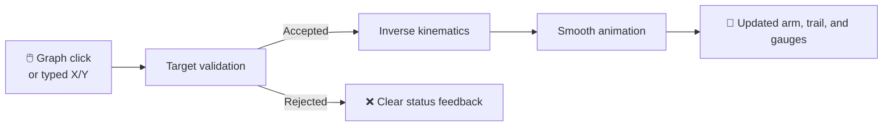

# 🤖 2-Link Robot Inverse Kinematics Simulator

An interactive Python simulator for a planar two-link robot arm. Select a target by clicking the graph or by entering exact X and Y coordinates. The simulator validates the target against the configured kinematics and joint limits, then animates the arm to a valid position.


> 🦾 A visual, constraint-aware 2D arm simulator built to make inverse kinematics easy to explore.

## ✨ Features

- Click-to-move target selection
- Precise X/Y coordinate input with a Move button
- Inverse-kinematics validation before motion
- Visual workspace based on the configured link lengths and joint limits
- Smooth arm motion with an end-effector trajectory trail
- Live shoulder, elbow, and servo position bars
- Clear accepted, rejected, and reached status messages

## 🧭 How It Works



The application uses one target-movement path for both mouse clicks and typed coordinates. This keeps validation, joint limits, animation, dashboard values, and feedback consistent.

## 🚀 Running the Simulator

### Requirements

- Python 3
- NumPy
- Matplotlib

### Start

Create and activate a virtual environment if you do not already have one, install the dependencies, then run:

```bash
python -m venv .venv
source .venv/bin/activate
pip install numpy matplotlib
python main.py
```

On Windows PowerShell, activate the environment with:

```bash
.venv\Scripts\Activate.ps1
```

The simulator opens in a Matplotlib window.

## 🎮 Controls

### 🖱️ Click-to-move

Click inside the graph to select a target position. The X and Y fields update to show the selected coordinates.

### ⌨️ Precise coordinate input

Enter numeric X and Y values in the side panel, then select **Move**. Typed coordinates use the same validation and animation path as a graph click.

### ✅ Target feedback

| Result | What happens |
| --- | --- |
| Valid target | The status turns green, the arm moves smoothly, the trail is drawn, and the status finishes at **Target reached.** |
| Invalid coordinates | The status turns red and asks for valid numeric X and Y values. |
| Unreachable or limit-rejected target | The arm remains at its current position and the status turns red. |

## 🎨 Visual Guide

| Element | Meaning |
| --- | --- |
| 🔵 Blue arm | Current robot position |
| 🟠 Orange cross | Selected target |
| 🟠 Orange dashed line | End-effector path for the current move |
| 🟢 Green workspace | Positions available under the current configuration |
| ✅ Green status text | Accepted target or completed motion |
| ❌ Red status text | Invalid input or a rejected target |
| 📊 Right-side bars | Current shoulder, elbow, and servo values within their configured ranges |

## 📐 Joint Conventions

- **Shoulder (Theta 1):** `0°` points downward. Positive angles rotate anticlockwise.
- **Elbow (Theta 2):** `0°` is fully straight and `180°` is fully folded. Negative elbow angles are disabled.
- **Servo angle:** currently matches the elbow angle. It is retained for a future hardware calibration layer, where servo mounting offset, rotation direction, or gearing may require a different command value.

## ⚙️ Current Configuration

| Setting | Value | Meaning |
| --- | ---: | --- |
| Upper-arm length (`L1`) | `5` units | Shoulder to elbow |
| Forearm length (`L2`) | `4` units | Elbow to hand/end effector |
| Shoulder range | `-90°` to `180°` | Clockwise/backward to anticlockwise/upward limit |
| Natural elbow range | `0°` to `180°` | Straight to fully folded; negative elbow motion is disabled |
| Servo command range | `0°` to `270°` | Allowed physical servo representation |
| Geometric reach | `1` to `9` units | Derived from `|L1 - L2|` to `L1 + L2`; joint limits further restrict the usable region |

The green workspace is a visualization of the positions available under the configured shoulder and elbow limits. A target can be within the basic geometric distance range yet still be rejected if no allowed joint configuration reaches it.

## 🦾 Human Arm Model

The robot is an idealized side-view human arm in the XY plane:

- The base joint represents the shoulder.
- The first link represents the upper arm and the second link represents the forearm.
- The end effector represents the hand. In this simplified model, the hand is considered to face the positive X direction.
- The arm moves only within the 2D XY plane. There is no depth or Z-axis motion, so the displayed links keep their fixed lengths instead of appearing shorter through perspective or projection.
- Motion comes from the shoulder and elbow only. Wrist bending, wrist rotation, hand orientation changes, and other 3D human-arm movements are outside the current model.

### What the model can and cannot represent

| Represented | Outside the current model |
| --- | --- |
| Shoulder rotation in the plane | Depth or Z-axis movement |
| Elbow bending in the plane | Wrist bend and wrist rotation |
| Fixed upper-arm and forearm lengths | Hand orientation changes during a move |
| Positioning the end effector in XY space | Full 3D human-arm motion or perspective effects |

## 🗂️ Project Structure

| File | Responsibility |
| --- | --- |
| `main.py` | Application setup, input controls, and target interaction |
| `animation.py` | Workspace display, animation, status feedback, and dashboard drawing |
| `kinematics.py` | Inverse and forward kinematics calculations |
| `config.py` | Link lengths and joint/servo limits |

## 🛡️ Current Constraints

The simulator rejects targets that are too far away, too close to the base, or outside the configured joint limits. The kinematics, coordinate conventions, and limits are intentionally kept separate from the interface and animation code.

### Validation sequence

1. Check whether the target lies between the minimum and maximum geometric reach.
2. Calculate the positive-elbow inverse-kinematics solution.
3. Check the shoulder limit.
4. Check the natural elbow and servo ranges.
5. Animate only when a complete valid configuration exists.
